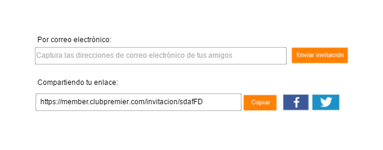
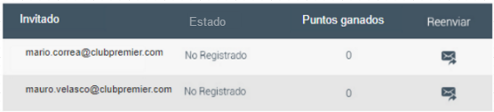
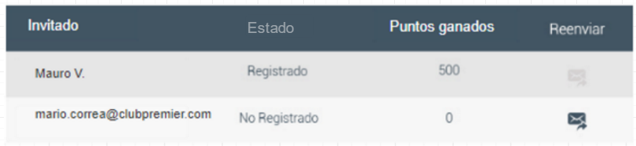

# Resumen

El sistema consiste de tres páginas web, una de ellas residirá en el CMS y las otras dos residirán dentro del dominio member. De las dos que están en member una de ellas será el *landing anfitrión* y otra el *landing invitado*. Además se harán modificaciones al sistema de inscripción de usuarios.

La página dentro del CMS mostrará la información general de la promoción, antes de que un socio pueda participar como anfitrión es requerido que visite esta página, en ella se tendrá un botón de *participar* con un link hacia el landing anfitrión que tendrá un parametro especial para inscribirse como anfitrión. El CMS tendrá las siguientes funciones:

- Mostrar la información de la promoción
- Redirigir al landing anfitrión con un parametro especial para inscribir al socio como anfitrión

El landing anfitrión reside dentro de member. Cuando se accede a él tendrá la capacidad de inscribir a los socios como anfitriones cuando se le pase un parametro especial, una vez registrados como anfitriones podrán acceder al contenido, tendrá dos módulos, uno para poder enviar las invitaciones a sus conocidos, a este lo llamamos *invitar amigos*, y otro para monitorear el registro de invitados y cuantos puntos le han generado llamado *monitor de invitados*. Las funciones que los socios tienen en el *landing anfitrión* son las siguientes:

- Inscribirse a la promoción como anfitriones al acceder con el parametro especial
- Invitar amigos
	- Por correo
	- Copiando un link
	- Compartiendo en redes sociales el link (facebook y twitter)
- Visualizar información de las invitaciones enviadas
	- Estado (Registrado ó No registrado)
	- Nombre del invitado
	- Puntos generados
- Reenviar invitaciones

 Una vez que se accede se inscribirá a la promoción, c

El landing invitado se accede con el correo de invitación o por el link que comparte un anfitrión. Como parte del título del landing se mostrará el nombre del anfitrión. Existen dos tipos de socios que se pueden inscribir, socios nuevos o socios existentes, para los socios nuevos se les dará la opción de inscribirse, se le agregará el campo de referido a la hora de inscribirse y se le asignarán las campañas de la promoción, después se le mostrará una pantalla con todas las transacciones que le dan bono. Para los socios existentes hay restricciones en la promoción, se tendrá un sistema de pre-validación utilizando un web service para mostrar al socio las transacciones de promoción que aplican para él, una vez que la pre-validación fue exitosa se le asignarán dos campañas y una preferencia para inscribirlo en la promoción. Las funciones que los usuarios tienen en el *landing invitado* son las siguientes:

- Socio Nuevo
  - Inscribirse a la promoción como invitado de alguien
  - Ver todas las transacciones de la promoción
- Socio existente
  - Verificar si se puede inscribir como invitado
  - Pre-validar en qué promociones puede participar
  - Inscribirse a la promoción como invitado
  - Ver las transacciones en las que ese socio puede participar

Además de lo anterior se harán cambios en el sistema de inscripción de los usuarios. En la forma de inscripción se agregará un nuevo campo donde se podrá colocar el número de cuenta de un socio anfitrión, este campo se llenará automaticamente cuando el socio haya llegado a la inscripción por el link o correo de un anfitrión.

# Anfitrión

En esta sección se describen a detalle los puntos del requerimiento que tienen que ver con el flujo del anfitrión.

## Opciónes en el menú

Se agregarán dos opciones de menú, una para la página de información que residirá dentro del dominio del CMS y otra para *landing anfitrion* que estará en member.

### Opción de menú para página de CMS

Se debe agregar una opción en el menú para acceder a la página de información de la promoción que residira en el CMS, este debe estar bajo la categoría **Promociones** y se debe llamar **Invita a un amigo**, va a tener un logo y su URL debe ser `https://www.clubpremier.com/mx/invita-a-un-amigo`.

### Opción de menú para página *landing anfitrión* en member

Se debe agregar una opción en el menú para acceder al *landing anfitrión*, este debe estar bajo la categoría **Mi cuenta** y se debe llamar **Invita a un amigo** y su URL debe ser `https://member.clubpremier.com/invita-a-un-amigo`.

## Landing anfitrión

El socio ingresa al *landing anfitrión* a través de la liga que está en el menú o colocando directamente la URL `https://member.clubpremier.com/invita-a-un-amigo`. Esta página solo será accesible con una sesión iniciada, por lo que si el socio no tiene un sesión iniciada se deberá redirigir a la página de inicio de sesión. Esta página podrá inscribir a los socios como anfitriones si es que se pasa el parametro `inscripcion=true`, una vez inscrito a la promoción el anfitrión podrá acceder al contenido y los módulos de *invitar amigos* y *monitor invitados*.

[Flujo del *landing anfitrion*](img/flujo_landing_anfitrion.png)

[Flujo del *landing anfitrion* con ventanas](img/flujo_landing_anfitrion_ventanas.png)

### Alta en la promoción como anfitrión

Para darse de alta en la promoción como anfitrión se debe acceder a la URL del *landing anfitrión* con un parametro especial que indica que se aceptó participar en la promoción, `https://member.clubpremier.com/invita-a-un-amigo?inscripcion=true`. Para dar de alta hay que generar su código único el cual será almacenado en una tabla llamada *tabla_codigo_anfitrion*, esta tabla tendrá el número de cuenta del anfitrión y el código generado, además tendrá la fecha de inscripción.

Ejemplo *tabla_codigo_anfitrion*:

|cta_anfitrion|codigo|fecha_inscipcion|nombre|
|---|---|---|---|
0012312312|Ajdfs12D|2017-02-01|Mario M.

### Verificar acceso

Cuando se accede con una sesión se tiene que verificar si el socio ya es parte de la promoción, para esto podemos revisar la *tabla_codigo_anfitrion*, la cual contiene los códigos generados para los anfitriones, si no está en esta tabla quiere decir que aún no es parte de la promoción. Después hay que verificar si tiene el parametro de inscripción, en caso de que así sea se debe hacer la inscripción y proceder a mostrar la página, en caso contrario hay que redirigirlo a la URL `https://www.clubpremier.com/mx/invita-a-un-amigo`, para que en esa página se de de alta.

### Despliegue de página *landing anfitrión básica*

Si el socio ya es parte de la promoción y tiene una sesión iniciada podrá acceder a la página, la cual muestra el título, un banner y un texto descriptivo de la promoción, estos son estáticos y siempre los mismos, además mostrará los módulos de *invitar amigos* y de *monitor de invitados*.

[Landing anfitrión](img/interfaces/landing_anfitrion_basica.png)

## Módulo de *invitar amigos*

Este módulo consta de dos partes, un box donde se escriben los correos para enviar las invitaciones, el otro es un visor del link único del anfitrión con botones para poder copiarlo y compartirlo en redes sociales. El correo y el link son los que útilizarán los invitados para registrarse en el programa.



### Link único de anfitrión

Cada anfitrión debe tener un código único el cual está guardado en *tabla_codigo_anfitrion*, este código junto con una url `https://member.clubpremier.com/invitacion/` generan un link, este link es utilizado por el módulo de *invitar amigo* para hacer referencia a la página de invitación de ese socio en particular. Por ejemplo el código de un socio puede ser `gW3313Djfd`, entonces su link único sería `https://member.clubpremier.com/invitacion/gW3313Djfd`.

### Box de correos

En este box se pueden colocar las direcciones de correo a las que se quieren enviar las invitaciones, se puede poner uno o muchos correos, con el botón **Enviar** se envían los correos a través de una cuenta de SendGrid (la cuenta y contraseña deben ser solicitadas). Este box tiene un funcionamiento similar al que tiene gmail cuando se va a enviar un correo, se escribe un correo y cuando se presiona `Enter` este se agrupa y se le asigna un botón de eliminar, de esta forma se pueden escribir varias direcciones de correo e irlas eliminando de manera sencilla.

El box debe mostrar el texto **Captura las direcciones de correo electrónico de tus amigos** cuando no se haya colocado ningún texto.

[Módulo de invitar amigos, box solo](img/modulo_invitar_amigos_box_solo.png)

[Módulo de invitar amigos, box con varios correos](img/modulo_invitar_amigos_box_un_correo.png)

### Envío de correo

Cuando en el box existan direcciones de correos agrupadas y se presione el botón **Enviar** se deben enviar correos de invitación a dichas direcciones y se debe limpiar el box. Se debe colocar el nombre del anfitrión en el asunto y en el cuerpo del correo, además de que el botón **Aceptar invitación** tenga la URL del link único. Cuando se envían correos de invitación estos deben ser agregados a la tabla *tabla_invitados* para ser visualizados en el módulo *invitar amigos*.

[Ejemplo de correo](img/correo.png) *(Solo ilustrativo, no final)*

### Visor de link único

En este módulo se muestra el link único del anfitrión, una opción para copiarlo y una opción para compartirlo en redes sociales, se podrá compartir en facebooky twitter.

[Módulo de invitar amigos, compartir link](img/modulo_invitar_amigos_compartir.png) *(Solo ilustrativo, no final)*

## Módulo de *monitor de amigos*

*Monitor de amigos* es una tabla que muestra cuatro columnas, *Invitado*, *Estado*, *Puntos generados* y *Reenviar*. Esta tabla funciona para darle seguimiento a las invitaciones enviadas, saber quienes ya se registraron como invitado y cuantos puntos han generado. Cuando la tabla no tiene ningún registro esta no se debe mostrar.


Cuando el anfitrión envía un correo a través del módulo *invitar amigos* este correo es guardado en la columna *Invitado* con un *Estado* en *No registrado*, tendrá 0 puntos generados y en la columna *Reenviar* se dará la opción de reenviar el correo.



Cuando un invitado se inscribe a la promoción se busca en la *tabla_invitados* si es que se tiene guardado el correo del invitado, en caso de que sea así se cambia el texto del correo por el nombre y primer letra del apellido del invitado, se cambia *Estado* a *Registrado*. En caso de que el invitado no esté previamente registrado en la *tabla_invitados* entonces se agrega el registro.



Esta información debe ser guardada en una tabla en una base de datos, le llamaremos a esta tabla *tabla_invitados*. En esta tabla se tendrá almacenado el número de cuenta del anfitrión, número de cuenta del invitado (solo si es que ya se registró), el estado de esa invitación (puede ser *Registrado* o *No registrado*), el nombre (si es que no está registrado se pone la dirección de correo electrónico, en caso de que esté registrado se pone el primer nombre y la primer sigla de su apellido) y los puntos que ese invitado ha generado.

cta_anfitrion| cta_invitado| estado| nombre| puntos| validacion| fecha
---|---|---|---|---|---|---
Número de cuenta del anfitrión a 11 caracteres| Número de cuenta del invitado a 11 caracteres| estado, puede ser *registrado* o *no_registrado*| nombre identificador, si no está registrado es el correo, si está registrado es el primer nombre y primer letra del apellido (Mauro M.)| Número de puntos generados| Objeto que contiene los códigos de los partners que fueron validados para ese invitado|Fecha de inscripción

Club Premier va a generar una archivo diario *batch* llamado *registro_puntos_invita_a_un_amigo_`+fecha`* que será compartido por ftp, este archivo contendrá los registros de las acumulaciones que se han generado para cada anfitrión y el número de cuenta de quién las generó. Usando esto se puede actualizar en *tabla_invitados* los puntos generados por cada invitado, los puntos en el archivo no serán totales sino del día que se genere, así que habrá que sumar cada vez que llegue un archivo nuevo para tener el total de puntos generados. El formato de este archivo es el siguiente.

cta_anfitrion| cta_invitado| puntos| fecha
---|---|---|---
Número de cuenta del anfitrión a 11 caracteres|Número de cuenta del invitado a 11 caracteres| Número de puntos generados para ese día| Fecha de creación del registro

# Invitados

En la siguiente sección se describe el proceso de inscripción a la promoción para los invitados. Se pueden inscribir socios existentes o socios nuevos.

## Acceso al link del anfitrión, cookie del anfitrión

Un usuario que accede al link de un anfitrión, ya sea porque se lo compartieron o porque le llegó por correo, va a ser enviado al *landing invitado*, lo primero que el sistema va a hacer es crear una cookie que guarde la información del anfitrión, esto se hará para que sin importar qué flujo siga el usuario dentro de la página se tenga la información de quien lo invitó. Esta cookie tiene una duración de 2 días, si es que ya existía una cookie se va a sobreescribir.

## Landing Invitado sin sesión iniciada

En cuando el usuario accede al *landing invitado*. Si es que no existe una sesión iniciada se le mostrará la opción para *Iniciar sesión* o para *Inscribirse*. En el título del landing se mostrará el nombre del anfitrión como se muestra en el ejemplo de pantalla.

[Landing invitado sin sesión iniciada](img/landing_invitado_desc.png)

Título: *Pendiente*

Banner: *Pendiente*

Descripción: *Pendiente*

## Validaciones para el invitado que ya es socio

Si el socio da click en *Iniciar sesión* se le redirige a la página de inicio de sesión, una vez que haya iniciado sesión se regresa al *landing invitado*.

Cuando se accede al *landing invitado* con una sesión iniciada se harán dos verificaciones, en la primera se verifica que el invitado no sea invitado de alguien más, para esto se puede revisar en la tabla *tabla_invitados* si es que existe un registro de ese socio que ya esté registrado, en caso de que ya sea un invitado se mostrará un modal con un mensaje de error. La segunda verificación revisará si es que el anfitrión no sea un invitado directo del socio (esto significa que yo no puedo ser invitado de un invitado mío), para esto se puede revisar la tabla *tabla_invitados* y revisar si existe una registro que relacione al anfitrión y al invitado, en caso de que se encuentre esa relación se mostrará un mensaje de error en un modal.

## Cálculo de pre-validación

La pre-validación solo se realiza cuando el invitado ya es un socio existente y pasó las validaciones previas. Ya que la promoción tiene varias restricciones se va a pre-validar en cuales transacciones o con cuales partners puede ganar puntos el invitado, para esto se utilizará el web service *GetLastNTransaction2*.

El web service *GetLastNTransactions2* nos permite solicitar todas las transacciones que un socio haya realizado en un cierto intervalo de tiempo, además de esto nos permite filtrar las transacciones por tipo de actividad.

La idea es tener un objeto que contiene todos los códigos de los partners, de esta lista se van a ir removiendo los partners que se encuentren con el web wervice, la lista completa es la siguiente:

`{AM, PC, HX, HI, BH, STW, HY, HJ, HW, WH, BW, CHI, LQ, CS, ACC, MRM, BVA, HMX, SFI, SS, GFM, SE, SBI, PH, SBS}`

Existen dos principales categorías donde se pueden ganar puntos, por vuelos y por tranferencias.

Para calcular la participación en vuelos se van a solicitar las transacciones de los últimos 24 meses con el tipo de actividad *FLT* y el código de partner *AM*. Si es que esto regresa algún registro entonces ya no aplica a esta promoción y se remueve el partner `AM`.

Para las transacciones es diferente ya que estas están categorizadas, hay 3 tipos de actividad diferentes, uno para hoteles, uno para retail y otro para bancos. Por cada tipo de actividad se tendrán que solicitar las transacciones de los últimos 12 meses, revisar cada una e ir verificando de qué partners se hicieron transferencias, por cada partner que se realizó transferencia se va a remover ese partner de la lista.

El resultado de esta prevalidación va a ser un objeto que contenga los códigos de los partners con los que el socio si recibe bono.

Para más información así como la lista completa de partners y sus logos ver la documentación del webservice [aquí](#getlastntransactions2-spec)

## Inscripción a la promoción para socios existentes

Si es que la pre-validación es exitosa y se tiene el objeto resultado, entonces se procede a inscribir al socio a la promoción, este proceso son varios pasos:

- Agregar al socio a dos campañas
- Agregar al socio una preferencia con el número de cuenta del anfitrión
- Buscar si el socio ya existe en un registro del anfitrión, actualizar ese registro o crear uno nuevo

Si es que la pre-validación genera algún error por cualquier cosa se mostrará un mensaje de error para que lo intente más tarde.

### Agregar al socio a dos campañas

Al socio hay que agregarlo a dos campañas, esto se hace con el web service *AssignCampaigns*, los nombres de las campañas son: `BF17D` y `BF17E`. Por cada campaña hay que colocar tres fechas:

||||
---|---|---
StartDate| Fecha de inicio de campaña | 2017-05-01
EndDate| Fecha de fin de campaña | 2099-12-31
DateTargetted| Fecha de inscripción a la campaña | La fecha de inscripción

- Ejemplo de inscripción a las dos campañas: [Request](webservice/assigncampaignSocioExistenterequest.xml) [Response](webservice/assigncampaignSocioExistenteresponse.xml)

### Agregar al socio en una preferencia su anfitrión

Se va a agregar una preferencia para guardar quien es el anfitrión, la preferencia tiene el número **863**, con el código `INVTED`, esta preferencia representa que el socio es un *Invited* de alguien, entonces en esta preferencia se va a almacenar el número de cuenta del anfitrión (a 11 carateres).

Ejemplo: *Pendiente*

### Actualizar la tabla *tabla_invitados*

Por último hay que buscar en la tabla *tabla_invitados* si es que para el anfitrión ya existe un registro que tenga el correo que tiene el invitado. Si existe el registro entonces hay que actualizar la información en ese registro, si no existe entonces se creará un registro nuevo, sea cual sea el caso el resultado debe tener la siguiente información:

cta_anfitrion| cta_invitado| estado| nombre| puntos| validacion| fecha
---|---|---|---|---|---|---
Número de cuenta del anfitrión a 11 caracteres| Número de cuenta del invitado a 11 caracteres| *registrado*| el primer nombre y primer letra del apellido (Mauro M.)| 0| El objeto calculado en la pre-validación |Fecha de inscripción

[Flujo de *landing invitado*](img/flujo_landing_invitado_ventanas.png)

## Mostrar la pantalla de inscripción finalizada

Se le mostrará al socio la pantalla que muestra los partners con los que participa. Hay dos secciones principales, una es la de vuelos en la que solo se encuentra Aeroméxico y la otra es la de transferencias en la que participan muchos partners. Si en la pre-validación no está incluido AM, entonces la sección de vuelos se oculta, la sección de transferencias tiene los otros partners, solo deben aparecer los que están incluidos en la pre-validación, y deben estar ordenados por Bancos, Hoteles y Retail.

Con este proceso termina el flujo para el invitado que ya es socio.

## Invitado que aún no es socio

Cuando un usuario accede al *landind invitado* tiene la opción de inscribirse, si da click en esta opción entonces se redirige a la página de inscripción de Club Premier. El sistema de inscripción tendrá algunos cambios.

## Cambios en la página de inscripción

Se va a agregar un nuevo campo en la pantalla de inscripción, este va a ser el campo de *Anfitrión*, en este campo se va a poder colocar el número de cuenta de alguien que te haya invitado. La idea es que puedas inscribirte como invitado a pesar de no tener el link de un anfitrión, solo tienes que conocer su número de cuenta. Este campo debe tener las mismas validaciones que cualquier otro campo que utilice un número de cuenta, sin embargo no será un campo requerido.

## Llenado automático del campo Anfitrión

Si es que se detecta que existe una cookie con información de anfitrión, entonces este campo se llenará automáticamente, y además no podrá ser editable.

## Inscripción con el campo de Anfitrión llenado

Cuando un socio se inscribe y existe información en el campo de anfitrión, se harán dos cosas:

- Inscribir al socio de forma normal pero agregando el campo *RecommendersCardNo*
- Agregar al socio a dos campañas

### Inscripción incluyendo el campo *RecommendersCardNo*

El web service de EnrollMember que se utiliza para la inscripción de los socios tiene un campo llamado *RecommendersCardNo* que identifica si ese socio es referido, este campo solo se puede llenar cuando se inscribe al socio, y en él se coloca el número de cuenta del anfitrión, este número de cuenta se obtiene del campo *Anfitrión*, ya sea que lo coloca el socio o que se llena automáticamente por la cookie.

### Agregar a dos campañas

Se tiene que agregar a dos campañas, una para la parte de vuelos y una para la parte de tranferencias, cabe decir que estas campañas son diferentes a las campañas que utilizan los invitados que son socios. Esto se hace con el web service *AssignCampaigns*, los nombres de las campañas son: `BF17A` y `BF17B`.

||||
---|---|---
StartDate| Fecha de inicio de campaña | 2017-05-01
EndDate| Fecha de fin de campaña | 2099-12-31
DateTargetted| Fecha de inscripción a la campaña | La fecha de inscripción

- Ejemplo de inscripción a las dos campañas: [Request](webservice/assigncampaignSocioNuevorequest.xml) [Response](webservice/assigncampaignSocioExistenteresponse.xml)

## Mostrar la información de inscripción a la campaña

Una vez inscrito se mostrará la pantalla para completar los datos, esto es el mismo proceso de las inscripciones normales, sin embargo, después de que completan sus datos en lugar de que

## AssignCampaigns Spec

Agrega a un socio a una o varias campañas. En caso de éxito regresa todas las campañas a las que está suscrito el socio, en caso de error manda un mensaje de error. Solo se puede inscribir a una campaña una vez, si ya se está inscrito regresa error, las campañas ya no pueden borrarse ni modificarse una vez agregadas.

### URL de pruebas

http://cr5w5cptest.clubpremier.com/Mercator.CRIS.WebService.TESTCRIS/IVRWebService.asmx

### Autenticación

Necesaria, HTTP basic.

### Petición

Nombre| Descripción
---|---
CardNumber| Número de cuenta del socio
CampaignList| Debe contener los objetos Campaign de las campañas que se quieren agregar
Campaign| Objeto que representa una campaña
Campaign.PrcCode| Código de la promoción
Campaign.StartDate| Objeto que representa el inicio de la campaña
Campaign.StartDate.IsQuery| Debe estar en 'false'
Campaign.StartDate.QueryString| Debe estar vacío
Campaign.StartDate.HasValue| Debe ser 'true'
Campaign.StartDate.Value| Debe ser la fecha de inicio de la campaña
Campaign.EndDate| Objeto que representa el fin de la campaña
Campaign.EndDate.IsQuery| Debe estar en 'false'
Campaign.EndDate.QueryString| Debe estar vacío
Campaign.EndDate.HasValue| Debe ser 'true'
Campaign.EndDate.Value| Debe ser la fecha de fin de la campaña
Campaign.DateTargetted| Objeto que representa la fecha de cuando el socio se une a la campaña
Campaign.DateTargetted.IsQuery| Debe estar en 'false'
Campaign.DateTargetted.QueryString| Debe estar vacío
Campaign.DateTargetted.HasValue| Debe ser 'true'
Campaign.DateTargetted.Value| Debe ser la fecha en la que el socio se une a la campaña
Campaign.CardNumber| Número de cuenta del socio

### Ejemplos

#### Agregar a la campaña BF17A

```xml
<AssignCampaigns xmlns="http://skywards.com/Mercator.CRIS.WS">
  <CardNumber>00970011581</CardNumber>
  <CampaignList>
    <Campaign>
      <PrcCode>BF17A</PrcCode>
      <StartDate>
        <IsQuery>false</IsQuery>
        <QueryString></QueryString>
        <ContainsQueryOperators>false</ContainsQueryOperators>
        <HasValue>true</HasValue>
        <Value>2017-06-01</Value>
      </StartDate>
      <EndDate>
        <IsQuery>false</IsQuery>
        <QueryString></QueryString>
        <ContainsQueryOperators>false</ContainsQueryOperators>
        <HasValue>true</HasValue>
        <Value>2017-12-31</Value>
      </EndDate>
      <DateTargetted>
        <IsQuery>false</IsQuery>
        <QueryString></QueryString>
        <ContainsQueryOperators>false</ContainsQueryOperators>
        <HasValue>true</HasValue>
        <Value>2017-08-30</Value>
      </DateTargetted>
      <CardNumber>00970011581</CardNumber>
    </Campaign>
  </CampaignList>
</AssignCampaigns>
```

[request](webservice/assigncampaignBF17Arequest.xml) [response](webservice/assigncampaignBF17Aresponse.xml)

## GetLastNTransactions2 Spec

### URL de pruebas

http://cr5w5cptest.clubpremier.com/Mercator.CRIS.WebService.TESTCRIS/IVRWebService.asmx?op=GetLastNTransactions2

### Autenticación

Necesaria, HTTP basic. (solicitar claves de pruebas)

### Petición

Nombre| Descripción
---|---
activeCardNo| Número de cuenta del socio a solicitar, a 11 caracteres
fromTransDate| Fecha a partir de la cual se buscan los registros, en el formato `0001-01-01T00:00:00`
toTransDate| Fecha hasta la cual se buscan los registros, en el formato `0001-01-01T00:00:00`
activityType| Filtro de tipo de actividad
transFilter| Debe existir vacío
orderBy| Ordena los resultados por actividad `A` o por transferencia `T`
partnerCode| Filtro del código del partner

### Ejemplos

#### Ejemplo 1

Para solicitar los últimos dos años de transacciones de tipo FLT con partnerCode AM. Este será utilizado para verificar si aplican a la promoción de vuelos.

```xml
<soap:Body>
    <GetLastNTransactions2 xmlns="http://skywards.com/Mercator.CRIS.WS">
      <activeCardNo>00970011581</activeCardNo>
      <fromTransDate>2015-08-22</fromTransDate>
      <toTransDate>2017-08-22</toTransDate>
      <activityType>FLT</activityType>
      <transFilter></transFilter>
      <orderBy></orderBy>
      <partnerCode>AM</partnerCode>
    </GetLastNTransactions2>
</soap:Body>
```

[Request](webservice/example1request.xml) [Response](webservice/example1response.xml)

#### Ejemplo 2

Para solicitar el último año de transacciones de transferencias de puntos de bancos. Se utiliza el tipo de transacción BPT. Con el partner code hay que ver con cuales partners ya se hicieron tranferencias.

```xml
<soap:Body>
    <GetLastNTransactions2 xmlns="http://skywards.com/Mercator.CRIS.WS">
      <activeCardNo>00970011581</activeCardNo>
      <fromTransDate>2016-08-22</fromTransDate>
      <toTransDate>2017-08-22</toTransDate>
      <activityType>BPT</activityType>
      <transFilter></transFilter>
      <orderBy></orderBy>
      <partnerCode></partnerCode>
    </GetLastNTransactions2>
</soap:Body>
```

[Request](webservice/example2request.xml) [Response](webservice/example2response.xml)

#### Ejemplo 3

Para solicitar el último año de transacciones de transferencias de puntos de hoteles. Se utiliza el tipo de transacción LYP. Con el partner code hay que ver con cuales partners ya se hicieron tranferencias.

```xml
<soap:Body>
    <GetLastNTransactions2 xmlns="http://skywards.com/Mercator.CRIS.WS">
      <activeCardNo>00970011581</activeCardNo>
      <fromTransDate>2016-08-22</fromTransDate>
      <toTransDate>2017-08-22</toTransDate>
      <activityType>LYP</activityType>
      <transFilter></transFilter>
      <orderBy></orderBy>
      <partnerCode></partnerCode>
    </GetLastNTransactions2>
</soap:Body>
```

[Request](webservice/example3request.xml) [Response](webservice/example3response.xml)

#### Ejemplo 4

La útilma petición es para solicitar el último año de transacciones de transferencias de puntos de retail. Se utiliza el tipo de transacción RPT. Con el partner code hay que ver con cuales partners ya se hicieron tranferencias. La respuesta de este ejemplo no econtró ningún registro que coincidiera con el filtro.

```xml
<soap:Body>
    <GetLastNTransactions2 xmlns="http://skywards.com/Mercator.CRIS.WS">
      <activeCardNo>00970011581</activeCardNo>
      <fromTransDate>2016-08-22</fromTransDate>
      <toTransDate>2017-08-22</toTransDate>
      <activityType>RPT</activityType>
      <transFilter></transFilter>
      <orderBy></orderBy>
      <partnerCode></partnerCode>
    </GetLastNTransactions2>
</soap:Body>
```

[Request](webservice/example4request.xml) [Response](webservice/example4response.xml)

### Códigos

#### Codigos de tipo de actividad

`activityType` | Descripción
---|---
FLT| Vuelos
BPT| Tranferencias de bancos
RPT| Transferencias de retail
LYP| Transferencias de hoteles

#### Códigos de partners de hoteles

`partnerCode` | Descripción| Logo| Link de información
---|---|---|---
PC|Fiesta Rewards|[Link](https://s3.amazonaws.com/club_premier/invita/partners/PC.jpg)|[Link](https://www.clubpremier.com/mx/acumula/servicios-de-viaje/hoteles/fiesta-americana-fiesta-inn/transferencia/)
HX|Marriott Rewards|[Link](https://s3.amazonaws.com/club_premier/invita/partners/HX.jpg)|[Link](https://www.clubpremier.com/mx/acumula/servicios-de-viaje/hoteles/marriott-hotels/transferencia/)
HI|Hilton Honors|[Link](https://s3.amazonaws.com/club_premier/invita/partners/HI.jpg)|[Link](https://www.clubpremier.com/mx/acumula/servicios-de-viaje/hoteles/hilton-honors/transferencia/)
BH|IHG Rewards|[Link](https://s3.amazonaws.com/club_premier/invita/partners/BH.jpg)|[Link](https://www.clubpremier.com/mx/acumula/servicios-de-viaje/hoteles/intercontinental-hotels-group/transferencia/)
STW|Starwood|[Link](https://s3.amazonaws.com/club_premier/invita/partners/STW.jpg)|[Link](https://www.clubpremier.com/mx/acumula/servicios-de-viaje/hoteles/starwood-hoteles-and-resorts/)
HY|Hyatt Gold Passport|[Link](https://s3.amazonaws.com/club_premier/invita/partners/HY.jpg)|[Link](https://www.clubpremier.com/mx/acumula/servicios-de-viaje/hoteles/hyatt-hotels-resorts/transferencia/)
HJ|City Premios|[Link](https://s3.amazonaws.com/club_premier/invita/partners/HJ.jpg)|[Link](https://www.clubpremier.com/mx/acumula/servicios-de-viaje/hoteles/hoteles-city-express/transferencia)
HW|Carlson Reizdor Hotels|[Link](https://s3.amazonaws.com/club_premier/invita/partners/HW.jpg)|link no está disponible
WH|Wyndham Rewards|[Link](https://s3.amazonaws.com/club_premier/invita/partners/WH.jpg)|[Link](https://www.clubpremier.com/mx/acumula/servicios-de-viaje/hoteles/wyndham-hotel-group/transferencia/)
BW|Best Western|[Link](https://s3.amazonaws.com/club_premier/invita/partners/BW.jpg)|[Link](https://www.clubpremier.com/mx/acumula/servicios-de-viaje/hoteles/best-western/transferencia/)
CHI|Choice Privileges|[Link](https://s3.amazonaws.com/club_premier/invita/partners/CHI.jpg)|[Link](https://www.clubpremier.com/mx/acumula/servicios-de-viaje/hoteles/choice-hotels)
LQ|La Quinta Returns|[Link](https://s3.amazonaws.com/club_premier/invita/partners/LQ.jpg)|[Link](https://www.clubpremier.com/mx/acumula/servicios-de-viaje/hoteles/la-quinta-inns-suites/transferencia/)
CS|Círculo Real|[Link](https://s3.amazonaws.com/club_premier/invita/partners/CS.jpg)|[Link](https://www.clubpremier.com/mx/acumula/servicios-de-viaje/hoteles/grupo-real-turismo/transferencia/)
ACC|Accor Hotels|[Link](https://s3.amazonaws.com/club_premier/invita/partners/ACC.jpg)|[Link](https://www.clubpremier.com/mx/acumula/servicios-de-viaje/hoteles/accor-hotels/)

#### Códigos de partners de bancos

`partnerCode` | Descripción| Logo| Link de información
---|---|---|---
MRM|Membership Rewards México|[Link](https://s3.amazonaws.com/club_premier/invita/partners/MRM.jpg)|[Link](https://www.clubpremier.com/mx/acumula/bancos/transferencia/membership-rewards/)
BVA|Bancomer|[Link](https://s3.amazonaws.com/club_premier/invita/partners/BVA.jpg)|[Link](https://www.clubpremier.com/mx/acumula/bancos/transferencia/bancomer)
HMX|HSBC|[Link](https://s3.amazonaws.com/club_premier/invita/partners/HMX.jpg)|[Link](https://www.clubpremier.com/mx/acumula/bancos/transferencia/hsbc)
SFI|Inbursa|[Link](https://s3.amazonaws.com/club_premier/invita/partners/SFI.jpg)|[Link](https://www.clubpremier.com/mx/acumula/bancos/transferencia/inbursa)
SS|Invex|[Link](https://s3.amazonaws.com/club_premier/invita/partners/SS.jpg)|[Link](https://www.clubpremier.com/mx/acumula/bancos/transferencia/invex)
GFM|Banca Mifel|[Link](https://s3.amazonaws.com/club_premier/invita/partners/GFM.jpg)|[Link](https://www.clubpremier.com/mx/acumula/bancos/transferencia/mifel)
SE|Santander|[Link](https://s3.amazonaws.com/club_premier/invita/partners/SE.jpg)|[Link](https://www.clubpremier.com/mx/acumula/bancos/transferencia/superbonus-de-santander-brasil/)
SBI|Scotiabank|[Link](https://s3.amazonaws.com/club_premier/invita/partners/SBI.jpg)|[Link](https://www.clubpremier.com/mx/acumula/bancos/transferencia/scotiabank)


#### Códigos de partners de retail

`partnerCode` | Descripción| Logo| Link de información
---|---|---|---
PH|Palacio de Hierro|[Link](https://s3.amazonaws.com/club_premier/invita/partners/PH.jpg)|[Link](https://www.clubpremier.com/mx/acumula/tiendas-y-mas/tiendas/palacio-de-hierro)
SBS|Sanborns|[Link](https://s3.amazonaws.com/club_premier/invita/partners/SBS.jpg)|[Link](https://www.clubpremier.com/mx/acumula/tiendas-y-mas/tiendas/sanborns)

#### Códigos de partners de vuelos

`partnerCode` | Descripción| Logo| Link de información
---|---|---|---
AM|Aeroméxico|[Archivo de illustrator](adjuntos/logo_aeromexico.ai)|[Link](https://member.clubpremier.com/individual/acreditacion-retroactiva-aeromexico)

## Cambios en el módulo de inscripción

En el sistema de inscripción general de la página se harán cambios dependiendo de si se encuentra la cookie del anfitrión.

Si la cookie no está presente se mostrará un campo para agregar el número de cuenta de tu anfitrión, esto es para que de forma manual alguna persona pueda indicar si es invitado de alguien. Si este campo es llenado a la hora de inscribirse se agregará al campo *refered*, además se agregará al socio a la campaña `BF17B`. Si no se llena el campo se procedera de forma normal con la inscripción.

Si la cookie está presente no se mostrará el campo de anfitrión pero de igual forma se le agregará la información del anfitrión en el campo *refered* y se agregará a la campaña `BF17B`.

En cualquiera de los dos casos si es que se inscribe al socio en la promoción, ya sea porque manualmente colocó la información de sus anfitrión o porque se obtuvo automáticamente de la cookie, después de la segunda pantalla de llenado de datos se hará login automátimente y se redirigirá a la pantalla de *landing invitado* para que pueda ver la pre-validación.

[Flujo de inscripción](img/flujo_inscripcion.png)

[Flujo de inscripción ventanas](img/flujo_inscripcion_ventanas.png)
