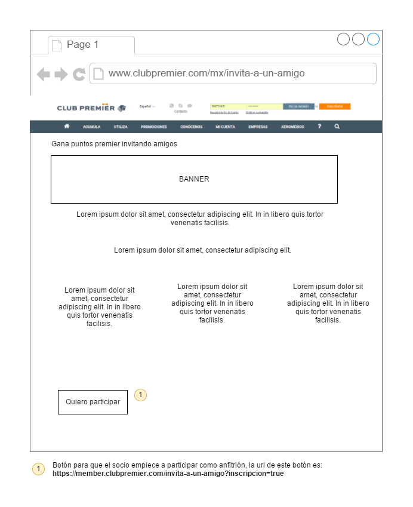
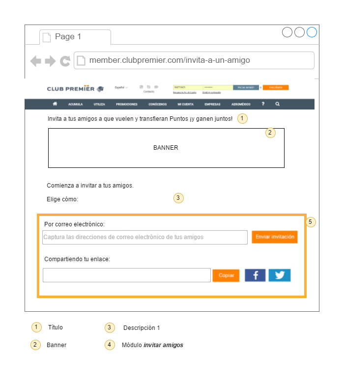
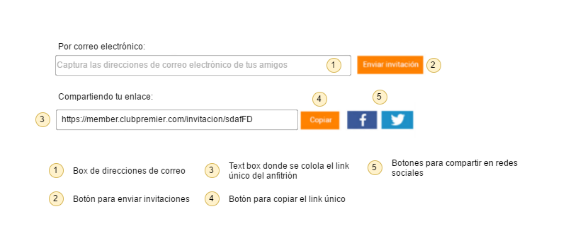
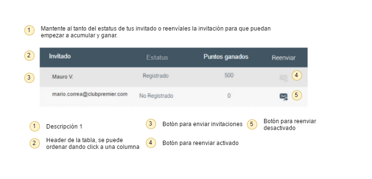

# Requerimientos de interfaces

## Anfitrión

### RIA0: Pantalla de información de la promoción en CMS

Pantalla que reside en el CMS donde se mostrará la información general de la promoción. Esta pantalla no será desarrollada por Vinco pero es parte del flujo.

### RIA1: Pantalla de anfitrión básica

Pantalla que verán los anfitriones donde pueden enviar invitaciones.

### RIA2: Pantalla de anfitrión con módulo de *monitor de invitados*

Pantalla que verán los anfitriones después de que envían invitaciones o alguien ha aceptado su invitación.

### RIA3: Módulo de *invitar amigos*

Este módulo se podrá ver siempre en el *landing anfitrión*, con él se podrán enviar invitaciones por correo electrónico y compartir el link único del anfitrion.

### RIA4: Módulo de *monitor de invitaciones*

Este módulo se muestra cuando existen invitaciones para dicho anfitrión, ya sean invitaciones que ya se han registrado o invitaciones que no se han registrado.

## Invitado

### Pantalla para solicitar el inicio de sesión

### Pantalla de espera mientras se hace el cálculo de la pre-validación

### Mensaje de error de alguien ya invitado

### Mensaje de error de alguien que es invitado de un invitado

## Inscripción

### Pantalla de inscripcíon con el campo de anfitrión

## Otros

# Requerimientos de bases de datos

# Requerimientos funcionales

En esta sección se enlistan los requerimientos solicitados para el proyecto. Se indica un id por cada uno y las dependencias entre sí.

## Opciones de menú

### TR01: Opción de menú de CMS

**Dependencias**: No

Cuando un usuario acceda en la sección de menú de **Promociones** debe existir la opción **Invita a un amigo** que tenga la dirección URL **`https://www.clubpremier.com/mx/invita-a-un-amigo`** y el ícono adjunto.

#### Adjuntos

Ícono: *Pendiente*

### TR02: Opción de menú de *landing anfitrión*

**Dependencias**: No

Cuando un usuario acceda en la sección de menú de **Mi cuenta** debe existir la opción **Invita a un amigo** que tenga la dirección URL **`https://member.clubpremier.com/invita-a-un-amigo`**.

## Página *landing anfitrión*

### TR03: Solicitar inicio de sesión en *landing anfitrión*

**Dependencias**: No

Cuando un usuario sin sesión iniciada accede a la URL **`https://member.clubpremier.com/invita-a-un-amigo`** se debe redireccionar a la pantalla de inicio de sesión, al iniciar su sesión correctamente se debe regresar a la página solicitada originalmente respetando los parametros que puedan existir en la URL.

### TR04: Redireccionar la página sin ser anfitrión

**Dependencias**: TR03

Cuando un socio con sesión iniciada acceda a la URL **`https://member.clubpremier.com/invita-a-un-amigo`**, si ese socio no está registrado dentro de *tabla_codigo_anfitrion* ni tiene en la URL el parametro `?incripcion=true`, se debe redireccionar al socio a la URL **`https://www.clubpremier.com/mx/invita-a-un-amigo`**.

### TR05: Inscripción de un anfitrión

**Dependencias**: TR04

Cuando un socio con sesión iniciada acceda a la URL **`https://member.clubpremier.com/invita-a-un-amigo?inscripcion=true`**, si el socio no es un anfitrión se tiene que:

- Generar su código único agregarlo a la tabla *tabla_codigo_anfitrion* con la fecha. 
- Agregar al socio la campaña `BF17A`.

#### Adjuntos

Ejemplo de websevice para agregar campaña `BF17A`: [request](webservice/assigncampaignBF17Arequest.xml) [response](webservice/assigncampaignBF17Aresponse.xml), [Especificación](/description/#assigncampaigns-spec)

### TR06: Visualizar *landing anfitrión* con módulo *invita amigo* (maquetación)

**Dependencias**: TR05

Si es que alguna de las precondiciones abajo descritas se cumple el socio deberá ver la página *landing anfitrión* con el contenido que se ve en la muestra de la pantalla, con el título, banner, descripción1, descripción2 y módulo de *invita amigos*.

#### Precondiciones

- Socio con sesión iniciada que accede a la URL del *landing anfitrión* y que está dentro de la tabla *tabla_codigo_anfitrion*.
- Socio que acaba de inscribirse como anfitrión (TR05).

#### Adjuntos

[**Muestra pantalla**](img/landing_anfitrion_basico_desc.png)

Título: *Pendiente*

Banner: *Pendiente*

Descripción 1: *Pendiente*

Descripción 2: 

> Comienza a invitar a tus amigos
> 

## Módulo de *invitar amigos*

### TR08: Agregar correos válidos en el box de correos del módulo *invitar amigos*

**Dependencias**: TR07

Cuando un usuario escriba una dirección de correo válida en el box y presione `Enter` o el box pierda el foco, la dirección de correo debe agruparse como se muestra en la figura.

#### Adjuntos

[**Flujo**](img/req_mod_inv_amg_box_cor_val.png)

### TR09: Agregar correos inválidos en el box de correos del módulo *invitar amigos*

**Dependencias**: TR08

Cuando un usuario escriba una dirección de correo inválida en el box y presione `Enter` o el box pierda el foco, la dirección de correo debe agruparse como se muestra en la figura.

#### Adjuntos

[**Flujo**](img/req_mod_inv_amg_box_cor_inv.png)

Diseño final: *Pendiente*

### TR10: Enviar correos de invitación

**Dependencias**: TR09

Cuando existan direcciones de correo válidas agrupadas en el box y el usuario presione el botón *Enviar invitación* se debe limpiar el box y se deben enviar a dichas direcciones el correo electrónico de invitación. Este correo debe tener el nombre del anfitrión y el link para compartir del anfitrión.

#### Adjuntos

Asunto del correo: *Pendiente*

HTML del correo: *Pendiente*

### TR11: Crear registro de la invitación

**Dependencias**: TR10

Cuando se envían el (los) correos de invitación (TR10), por cada dirección de correo a la que se envío la invitación se verificará si en los registros de ese anfitrión dentro de la tabla *tabla_invitados* existe esa dirección de correo, si no existe el registro se va a agregar llenando los campos de la siguiente forma:

cta_anfitrion| cta_invitado| estado| nombre| puntos
---|---|---|---|---
Número de cuenta del anfitrión|vacío|no_registrado|Dirección de correo|vacío

### TR12: Mensaje de envío de correo exitoso

**Dependencias**: TR11

Cuando un usuario envíe un correo en TR10, y el correo se envíe exitosamente se debe mostrar un mensaje de correo enviado exitosamente.

#### Adjuntos

[Ejemplo](img/modulo_invitar_amigos_2.png)

Mensaje: *Pendiente*

### TR13: Mensaje de envio de correo fallido

**Dependencias**: TR12

Cuando un usuario envíe un correo en TR10, y el correo no se pueda enviar por alguna razón, se debe mostrar un mensaje de error.

#### Adjuntos

Ejemplo: *Pendiente*

Mensaje: *Pendiente*

### TR14: Visualizar y copiar el link del anfitrión

**Dependencias**: TR07

Cuando un usuario visualiza el módulo de *invitar amigos* (TR07) debe poder ver su link único de anfitrión, este debe ser la URL `https://member.clubpremier.com/invitacion/` + *codigo del anfitrión*, al presionar el botón *Copiar* debe copiarse al portapapeles.

#### Adjuntos

[**Pantalla ejemplo**](img/modulo_invitar_amigos_compartir.png)

### TR15: Compartir en redes sociales el link del anfitrión

**Dependencias:** TR14

Cuando un usuario visualiza el módulo de *invitar amigos* TR07, al presionar los botones de facebook o twitter deberá poder compartir su link de anfitrión en dichas redes sociales.

#### Adjuntos

Mensaje de facebook: *Pendiente*

Mensaje de twitter: *Pendiente*

## Módulo de *monitor de invitados*

### TR16: Visualizar el módulo de *monitor de invitados*

**Dependencias:** TR11

Cuando un socio accede al *landing anfitrión* y existen registros en la tabla *tabla_invitados* de ese socio, el socio debe visualizar el módulo de *monitor de invitados* con los registros existentes. En caso que no existan registros el módulo no debe mostrarse.

### TR17: Reenviar una invitación

**Dependencias:** TR16

Cuando un socio visualiza el módulo de *monitor de invitados* y se presiona el botón de reenviar de los registros de invitaciones pendientes se debe enviar el correo de invitación a esa dirección de correo.

### TR18: Ordenar por columnas el módulo de *monitor de invitados*

**Dependencias:** TR16

Cuando un usuario de click en la cabecera de alguna columna de la tabla del módulo de *monitor de invitados* los registros de la tabla deben ordenarse alfabéticamente respecto a esa columna, si se da click nuevamente se debe cambiar la dirección del ordenamiento.

## Invitado que es socio existente

### TR: Guardar cookie con información del anfitrión

Cuando un usuario utilice el link de un anfitrión el navegador debe guardar la información del anfitrión en una cookie que tenga expiración de dos días. A esta cookie se le llamará *cookie anfitrión*

### TR: Acceder al landing invitado sin sesión iniciada

Cuando un usuario utilice el link de un anfitrión y no tenga una sesión iniciada, el usuario debe ver la pantalla (ref).

#### Adjuntos

- Pantalla de ejemplo

### TR: Iniciar sesión en landing invitado

Cuando un usuario acceda al landing invitado sin sesión iniciada y de click en el botón de *Iniciar sesión* se debe redirigir al inicio de sesión y regresar una vez haya iniciado sesión correctamente.

### TR: Verificación 1 al acceder al landing invitado

Cuando un usuario utilice un link de invitado y tenga sesión iniciada, si el invitado no es un invitado de alguien más pasa la validación, en caso contrario se mostrará una pantalla con un mensaje de error.

#### Adjuntos

- Pantalla ejemplo

### TR: Verificación 2 al acceder al landing invitado

**Dependencias**: TR (ref)

Cuando un usuario utilice un link de invitado y tenga sesión iniciada, si el invitado no es anfitrión del anfitrión, pasa la validación, en caso contrario se mostrará una pantalla con un mensaje de error. (Se refiere a que un socio no puede ser invitado de un invitado suyo).

#### Pasos

1. Usuario accede a 

#### Adjuntos

- Pantalla ejemplo

### TR: Mostrar spinner

Cuando un usuario utilice un link de invitado y pasó la verificación

### TR: Mensaje de error para socios que los invita su invitado

### TR: Hacer el calculo de la pre-validación

### TR: Mostrar pantalla de las transacciones que puede hacer el invitado

## Invitado socio nuevo

### TR: Dar click en botón de inscripción en el landing invitado

### TR: Agregar datos de referido en inscripción

### TR: Mostrar pantalla de todas las promociones

## Invitado generales

### TR: Buscar el correo del invitado en la lista de invitados y agregar