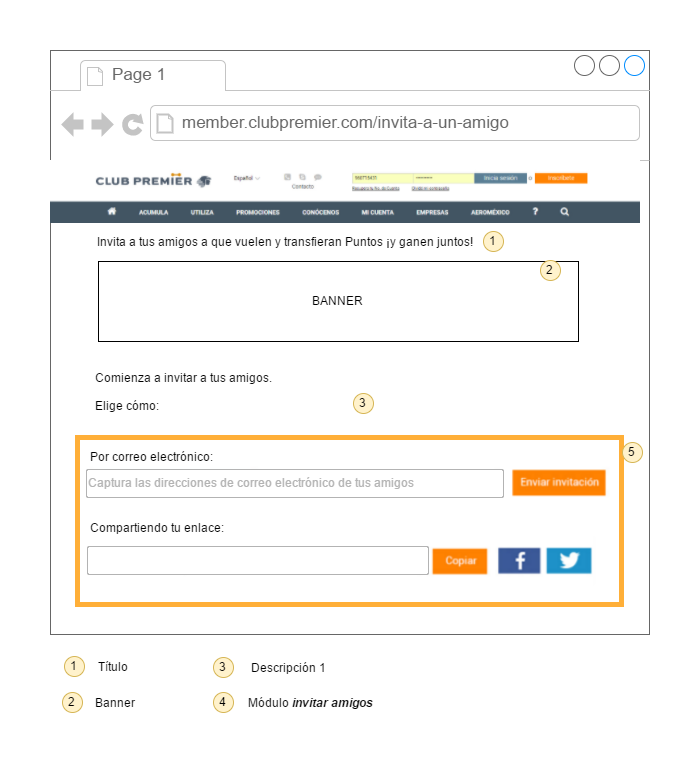
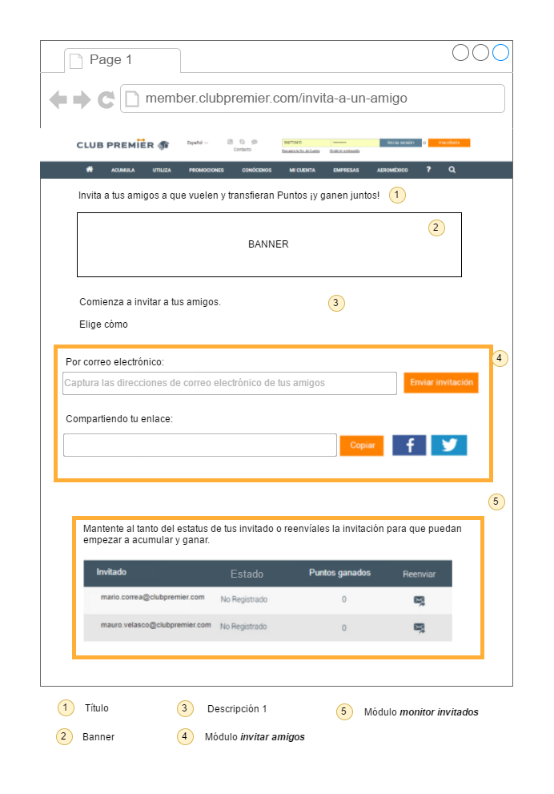
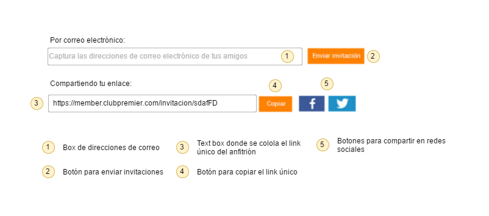

# Requerimientos de interfaces

### RIA0: Pantalla de información de la promoción en CMS

Pantalla que reside en el CMS donde se mostrará la información general de la promoción. Esta pantalla no será desarrollada por Vinco pero es parte del flujo.


### RIA1: Pantalla de anfitrión básica

Pantalla que verán los anfitriones donde pueden enviar invitaciones.



### RIA2: Pantalla de anfitrión con módulo de *monitor de invitados*

Pantalla que verán los anfitriones después de que envían invitaciones o alguien ha aceptado su invitación.



### RIA3: Módulo de *invitar amigos*

Este módulo se podrá ver siempre en el *landing anfitrión*, con él se podrán enviar invitaciones por correo electrónico y compartir el link único del anfitrion.



### RIA4: Módulo de *monitor de invitaciones*

Este módulo se muestra cuando existen invitaciones para dicho anfitrión, ya sean invitaciones que ya se han registrado o invitaciones que no se han registrado.


- Logo de reenvio de correo: [Logo habilitado](adjuntos/reenvio_correo.png) [Logo deshabilitado](adjuntos/reenvio_correo_deshabilitado.png)

# Requerimientos funcionales

En esta sección se enlistan los requerimientos solicitados para el proyecto. Se indica un id por cada uno y las dependencias entre sí.

### TR01: Opción de menú de CMS

**Dependencias**: No

Cuando un usuario acceda en la sección de menú de **Promociones** debe existir la opción **Invita a un amigo** que tenga la dirección URL **`https://www.clubpremier.com/mx/invita-a-un-amigo`** y el ícono adjunto.

#### Adjuntos

Ícono: [Archivo Adobe Illustrator](adjuntos/icono_menu.ai)

### TR02: Opción de menú de *landing anfitrión*

**Dependencias**: No

Cuando un usuario acceda en la sección de menú de **Mi cuenta** debe existir la opción **Invita a un amigo** que tenga la dirección URL **`https://member.clubpremier.com/invita-a-un-amigo`**.

### TR03: Solicitar inicio de sesión en *landing anfitrión*

**Dependencias**: No

Cuando un usuario sin sesión iniciada accede a la URL **`https://member.clubpremier.com/invita-a-un-amigo`** se debe redireccionar a la pantalla de inicio de sesión, al iniciar su sesión correctamente se debe regresar a la página solicitada originalmente respetando los parametros que puedan existir en la URL.

### TR04: Redireccionar la página sin ser anfitrión

**Dependencias**: TR03

Cuando un socio con sesión iniciada acceda a la URL **`https://member.clubpremier.com/invita-a-un-amigo`**, si ese socio no está registrado dentro de *tabla_codigo_anfitrion* ni tiene en la URL el parametro `?incripcion=true`, se debe redireccionar al socio a la URL **`https://www.clubpremier.com/mx/invita-a-un-amigo`**.

### TR05: Inscripción de un anfitrión

**Dependencias**: TR04

Cuando un socio con sesión iniciada acceda a la URL **`https://member.clubpremier.com/invita-a-un-amigo?inscripcion=true`**, si el socio no es un anfitrión se tiene que generar su código único y agregarlo a la tabla *tabla_codigo_anfitrion* con la fecha y su nombre (incluyendo primer letra del apellido).

### TR06: Visualizar *landing anfitrión* con módulo *invita amigo* (maquetación)

**Dependencias**: TR05

Si es que sucede alguna de estas:

- Socio con sesión iniciada que accede a la URL del *landing anfitrión* y que está dentro de la tabla *tabla_codigo_anfitrion*.
- Socio que acaba de inscribirse como anfitrión (TR05).

Entonces el socio deberá ver la página *landing anfitrión básico*.

#### Adjuntos

[**Muestra pantalla**](img/interfaces/landing_anfitrion_basica.png)

[**Muestra módulo invitar amigos**](img/interfaces/modulo_invita_amigos.png)

Título: Invita a tus amigos a que vuelen y transfieran Puntos ¡y ganen juntos!

[Banner](img/assets/landing_anfitrion_banner.jpg)

Descripción:

```
Comienza a invitar a tus amigos.

Elige cómo:
```

Logos redes sociales: [Archivo Adobe Illustrator](adjuntos/logos_redes_sociales.ai) [Imagen Facebook](adjuntos/logo_facebook.jpg) [Imagen Twitter](adjuntos/logo_twitter.jpg)

### TR08: Agregar correos válidos en el box de correos del módulo *invitar amigos*

**Dependencias**: TR07

Cuando un usuario escriba una dirección de correo válida en el box y presione `Enter` o el box pierda el foco, la dirección de correo debe agruparse como se muestra en la figura.

#### Adjuntos

[**Flujo**](img/req_mod_inv_amg_box_cor_val.png)

### TR09: Agregar correos inválidos en el box de correos del módulo *invitar amigos*

**Dependencias**: TR08

Cuando un usuario escriba una dirección de correo inválida en el box y presione `Enter` o el box pierda el foco, la dirección de correo debe agruparse como se muestra en la figura.

#### Adjuntos

[**Flujo**](img/req_mod_inv_amg_box_cor_inv.png)

### TR10: Enviar correos de invitación

**Dependencias**: TR09

Cuando todas las direcciones de correo agrupadas en el box sean válidas y el usuario presione el botón *Enviar invitación* se debe limpiar el box y se deben enviar a dichas direcciones el correo electrónico de invitación. Este correo debe tener el nombre del anfitrión y el link para compartir del anfitrión.

#### Adjuntos

Asunto del correo: %%Nombreanfitrión%%, te invitó a ganar  15% MÁS  Puntos Premier

HTML del correo: [archivo](adjuntos/mailing.html)

Ejemplo del correo: [psd](adjuntos/ejemplo_correo.psd)

### TR11: Crear registro de la invitación

**Dependencias**: TR10

Cuando se envían el (los) correos de invitación (TR09), por cada dirección de correo a la que se envío exitosamente se verificará si en los registros de ese anfitrión dentro de la tabla *tabla_invitados* existe esa dirección de correo, si no existe el registro se va a agregar llenando los campos de la siguiente forma:

cta_anfitrion| cta_invitado| estado| nombre| puntos| validacion
---|---|---|---|---|---
Número de cuenta del anfitrión|vacío|no_registrado|Dirección de correo|vacío|vacío

### TR12: Mensaje de envío de correo exitoso

**Dependencias**: TR11

Cuando un usuario envíe un correo en TR10, y el correo se envíe exitosamente se debe mostrar un mensaje de correo enviado exitosamente.

#### Adjuntos

Mensaje: Ahora, ya puedes empezar a ganar, el envío fue exitoso

### TR13: Mensaje de envio de correo fallido

**Dependencias**: TR12

Cuando un usuario envíe un correo en TR10, y el correo no se pueda enviar por alguna razón, se debe mostrar un mensaje de error.

#### Adjuntos

Mensaje por fallo al enviar: ¡Ups! El correo no fue enviado, inténtalo de nuevo.

Mensaje por correos invalidos: ¡Ups! Hay correos no válidos, por favor, verifica la dirección de correo electrónico.

### TR14: Visualizar y copiar el link del anfitrión

**Dependencias**: TR07

Cuando un anfitrión visualiza el módulo de *invitar amigos* (TR07) debe poder ver su link único de anfitrión, este debe ser la URL `https://member.clubpremier.com/invitacion/` + *codigo del anfitrión*, al presionar el botón *Copiar* debe copiarse al portapapeles.

#### Adjuntos

[**Pantalla ejemplo**](img/modulo_invitar_amigos_compartir.png)

### TR15: Compartir en redes sociales el link del anfitrión

**Dependencias:** TR14

Cuando un usuario visualiza el módulo de *invitar amigos* TR07, al presionar los botones de facebook o twitter deberá poder compartir su link de anfitrión en dichas redes sociales.

#### Adjuntos

Tags para facebook:

``` html
<meta property="og:title" content="Inscr&iacute;bete sin costo a Club Premier"/>
<meta property="og:type" content="website"/>
<meta property="og:image" content="https://s3.amazonaws.com/club_premier/invita/invitacion.jpg"/>
<meta property="og:image:width" content="1200"/>
<meta property="og:image:height" content="600"/>
<meta property="og:site_name" content="Club Premier"/>
<meta property="og:description" content="Ganemos juntos m&aacute;s Puntos Premier, empieza aqu&iacute;."/>
```

Tags para twitter:

``` html
<meta name="twitter:card" content="summary_large_image"/>
<meta name="twitter:title" content="Inscribete sin costo a Club Premier"/>
<meta name="twitter:description" content="Te invito a ganar conmigo m&aacute;s Puntos Premier, mira como %%Link del anfitrion%%"/>
<meta name="twitter:image" content="https://s3.amazonaws.com/club_premier/invita/invitacion.jpg"/>
<meta itemprop="image" content="https://s3.amazonaws.com/club_premier/invita/invitacion.jpg"/>
```

### TR16: Visualizar invitaciones enviadas por correo

**Dependencias:** TR11

Cuando un anfitrión accede al *landing anfitrión* y envía correos de invitación (TR09), por cada dirección de correo que se envió correctamente si no existe este registro en el *monitor de invitados* este registro se debe agregar. (Esto se refiere a que cuando se manden invitaciones el anfitrión pueda ver que las invitaciones nuevas se agregan al módulo inmediatamente sin tener que recargar la página o hacer alguna acción.)

### TR17: Visualizar el módulo de *monitor de invitados*

**Dependencias:** TR11

Cuando un anfitrión accede al *landing anfitrión* y existen registros en la tabla *tabla_invitados* asociados con él, el socio debe visualizar el módulo de *monitor de invitados* con dichos registros. En caso que no existan registros el módulo no debe mostrarse.

Ícono: [Archivo Adobe Illustrator](adjuntos/icono_reenviar.ai)

### TR18: Reenviar una invitación

**Dependencias:** TR17

Cuando un socio visualiza el módulo de *monitor de invitados* y presiona el botón *Reenviar* de una invitación no registrada, se debe enviar el correo de invitación a esa dirección de correo.

### TR19: Ordenar por columnas el módulo de *monitor de invitados*

**Dependencias:** TR17

Cuando un usuario de click en la cabecera de alguna columna de la tabla del módulo de *monitor de invitados* los registros de la tabla deben ordenarse alfabéticamente respecto a esa columna, si se da click nuevamente se debe cambiar la dirección del ordenamiento.

### TR20: Leer archivo batch con puntos y actualizar *tabla_invitados*

**Dependencias:** TR05

Debe existir un sistema que a una hora especifica del día lea el archivo llamado *registro_puntos_invita_a_un_amigo_`+fecha`*, por cada registro debe buscar el registro en la tabla *tabla_invitados* que coincide con el número de cuenta de anfitrión y de invitado y sumar los puntos.
