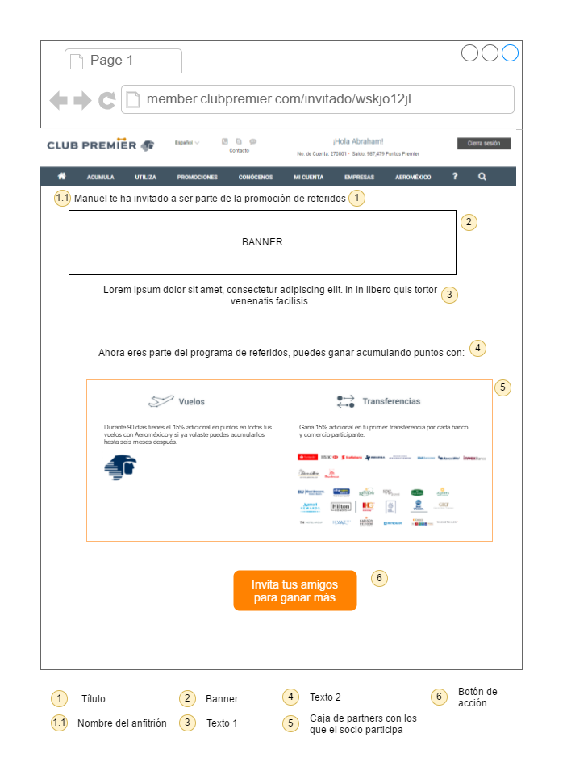

# Requerimientos de interfaces

### RIN1: Pantalla de inscripción con el campo de anfitrión

Esta es la nueva pantalla de inscripción, se va a agregar el campo *Anfitrión*, con validación igual que para un número de cuenta pero no obligatorio.

### RIN2: Pantalla de mensaje para ver beneficios

Cuando un socio nuevo se inscribe como anfitrión se le mostrará esta pantalla para que presionando un botón pueda ver los beneficios de la promoción, este modal estará encima del formulario para completar los datos.

### RIN3: Pantalla de información de beneficios

Pantalla donde se muestra con cuales partners el socio participa, este ejemplo de pantalla es para cuando participa en vuelos y transferencias.

Id | Elemento | Contenido
---|---|---
1|Título | Te decimos cómo puedes ganar más Puntos Premier
2|Banner | Pendiente
3|Texto 1 | Gana 15% más Puntos Premier  al transferir tus  puntos  de otras empresas  afiliadas a Club Premier, así como por la acumulación de tus vuelos con Aeroméxico.
4|Texto 2 | Gana más Puntos Premier con:
5|Logo Vuelos| [Link](https://s3.amazonaws.com/club_premier/invita/vuelos.png)
5|Logo Transferencias| [Link](https://s3.amazonaws.com/club_premier/invita/transferencias.png)
5|Texto vuelos| Si vuelas o volaste con Aeroméxico, tienes un periodo de 90 días* a partir de tu registro para  ganar 15% más Puntos Premier. \*Recuerda que puedes registrar tus vuelos realizados de seis meses atrás a la fecha.
5|Texto transferencias| Gana 15% mas Puntos Premier por tu primer transferencia de puntos.
5|Links Logos partners hoteles| [PC](https://s3.amazonaws.com/club_premier/invita/partners/PC.jpg), [HX](https://s3.amazonaws.com/club_premier/invita/partners/HX.jpg), [HI](https://s3.amazonaws.com/club_premier/invita/partners/HI.jpg), [BH](https://s3.amazonaws.com/club_premier/invita/partners/BH.jpg), [STW](https://s3.amazonaws.com/club_premier/invita/partners/STW.jpg), [HY](https://s3.amazonaws.com/club_premier/invita/partners/HY.jpg), [HJ](https://s3.amazonaws.com/club_premier/invita/partners/HJ.jpg), [HW](https://s3.amazonaws.com/club_premier/invita/partners/HW.jpg), [WH](https://s3.amazonaws.com/club_premier/invita/partners/WH.jpg), [BW](https://s3.amazonaws.com/club_premier/invita/partners/BW.jpg), [CHI](https://s3.amazonaws.com/club_premier/invita/partners/CHI.jpg), [LQ](https://s3.amazonaws.com/club_premier/invita/partners/LQ.jpg), [CS](https://s3.amazonaws.com/club_premier/invita/partners/CS.jpg), [ACC](https://s3.amazonaws.com/club_premier/invita/partners/ACC.jpg)
5|Links Logos partners bancos| [MRM](https://s3.amazonaws.com/club_premier/invita/partners/MRM.jpg), [BVA](https://s3.amazonaws.com/club_premier/invita/partners/BVA.jpg), [HMX](https://s3.amazonaws.com/club_premier/invita/partners/HMX.jpg), [SFI](https://s3.amazonaws.com/club_premier/invita/partners/SFI.jpg), [SS](https://s3.amazonaws.com/club_premier/invita/partners/SS.jpg), [GFM](https://s3.amazonaws.com/club_premier/invita/partners/GFM.jpg), [SE](https://s3.amazonaws.com/club_premier/invita/partners/SE.jpg), [SBI](https://s3.amazonaws.com/club_premier/invita/partners/SBI.jpg)
5|Links Logos partners retail| [PH](https://s3.amazonaws.com/club_premier/invita/partners/PH.jpg), [SBS](https://s3.amazonaws.com/club_premier/invita/partners/SBS.jpg)
5|Logo Aeroméxico| [Link](https://s3.amazonaws.com/club_premier/invita/aeromexico.png)
6|Texto botón| Empieza a invitar y gana más Puntos Premier con tus amigos

# Requerimientos funcionales

### TRN01: Visualizar campo de Anfitrión en formulario de inscripción

*Dependencias*: No

Cuando un usuario acceda al formulario de inscripción, este debe ver un campo llamado **Anfitrión**. Este campo solo debe aceptar números, debe tener la validación de un número de cuenta válido sin embargo no es un campo obligatorio en el formulario.

### TRN02: Autocompletar campo de *Anfitrión*

*Dependencias*: TRI01, TRN01

Cuando un usuario accede a la página de inscripción, el sistema deberá verificar si el navegador tiene la cookie generada en [TRI01](requerimientos_invitado/#tri01-guardar-cookie-con-informacion-del-anfitrion), si es así deberá llenar automáticamente la información del campo *Anfitrión* con el número de cuenta del anfitrión y bloquear la edición de dicho campo.

### TRN04: Inscribir invitado, socio nuevo

*Dependencias*: No

Cuando un usuario llene el formulario de inscripción correctamente, y exista información en el campo de *Anfitrión* (ya sea que el usuario la colocó o fue automático), y el usuario de click para inscribirse, el sistema deberá enrolar al socio utilizando el web service *EnrollMember* incluyendo el parámetro **RecommendersCardNo** con el número de cuenta del anfitrión. Después el sistema debe agregar al socio a dos campañas, la `BF17A` y la `BF17B`.

#### Adjuntos

- Nombre de campañas: `BF17A` `BF17B`

- Ejemplo de enrolamiento: *Pendiente*

- Ejemplo de inscripción a las dos campañas: [Request](webservice/assigncampaignSocioNuevorequest.xml) [Response](webservice/assigncampaignSocioExistenteresponse.xml)

### TRN05: Agregar el registro del invitado que es socio nuevo

Después de que se inscribe al invitado que es socio nuevo (TRN04), el sistema debe agregar el registro a la tabla *tabla_invitados*. Si para el anfitrión ya existe un registro dentro de la tabla que tenga el mismo correo que el correo del invitado, el registro debe actualizarse, en caso de que no exista se debe agregar el registro con los siguientes datos.

cta_anfitrion| cta_invitado| estado| nombre| puntos| validacion| fecha
---|---|---|---|---|---|---
Número de cuenta del anfitrión a 11 caracteres| Número de cuenta del invitado a 11 caracteres| *registrado*| el primer nombre y primer letra del apellido (Mauro M.)| 0| El objeto de partners completo |Fecha de inscripción

#### Adjuntos

- Objeto de partners completo: `{AM, PC, HX, HI, BH, STW, HY, HJ, HW, WH, BW, CHI, LQ, CS, ACC, MRM, BVA, HMX, SFI, SS, GFM, SE, SBI, PH, SBS}`

### TRN06: Mostrar pantalla de datos con modal de beneficios

*Dependencias*: No

Después de que el socio se inscribe deberá ser dirigido a la página para completar sus datos, el socio debe ver en esta página un modal como en [RIN2](#rin2-pantalla-de-mensaje-para-ver-beneficios)

### TRN07: Mostrar pantalla de beneficios en pestaña nueva

*Dependencias*: No

Cuando un socio da click en el botón de *Beneficios* en el modal de TRN06, el navegador deberá abrir una nueva pestana con la pantalla para visualizar los partners de la promoción [RIN3](#rin3-pantalla-de-informacion-de-beneficios)
