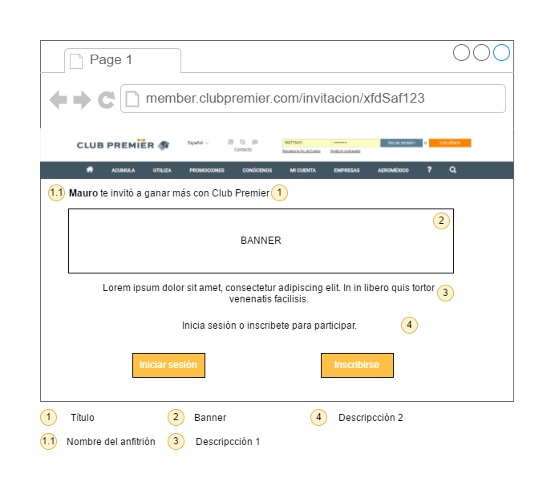
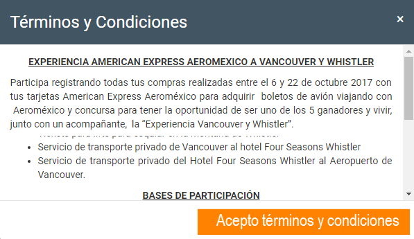
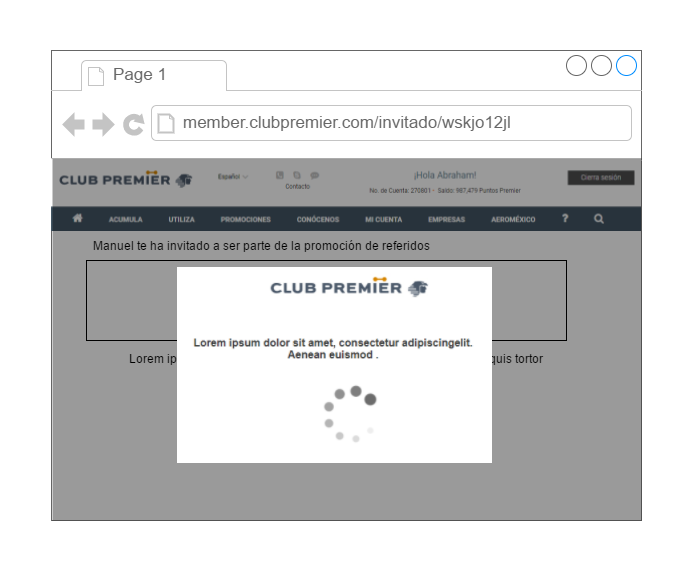
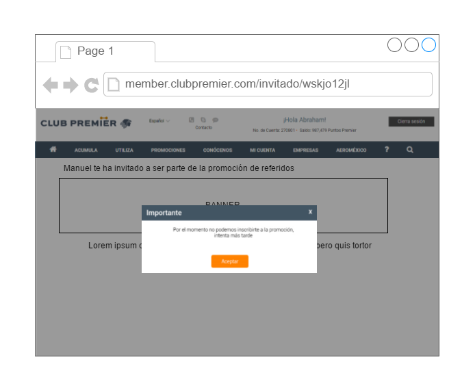
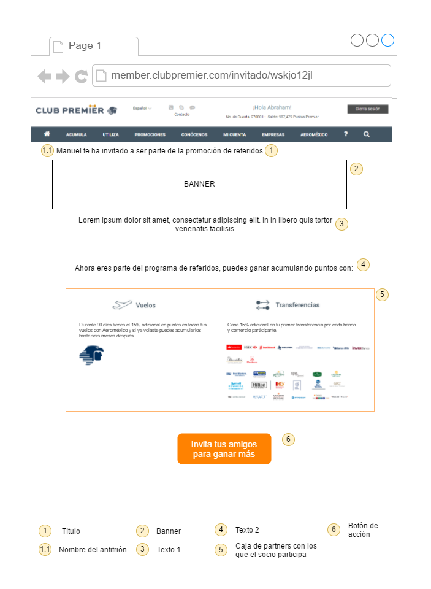
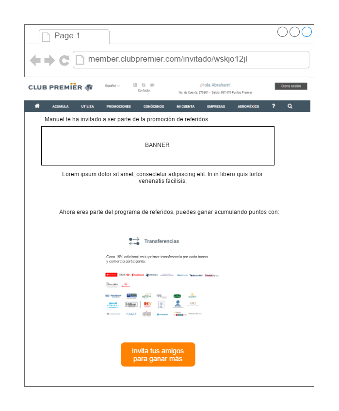

# Requerimientos de interfaces

### RII1: Pantalla para solicitar el inicio de sesión o inscripción

Pantalla que se muestra cuando no existe una sesión iniciada, se dan opciones para iniciar sesión o para inscribirse.

Id | Elemento | Contenido
---|---|---
1|Título | %%Nombre de anfitrión%% te ha invitado a ganar más Puntos Premier
2|Banner | [Link](https://s3.amazonaws.com/club_premier/invita/invitado-hd-a.jpg)
3|Descripción 1 | Acepta la invitación y gana 15% más Puntos Premier por transferir tus puntos de otras empresas afiliadas a Club Premier y/o por acumular tus vuelos con Aeroméxico.
4|Descripción 2 | Inicia sesión o inscríbete a Club Premier para empezar a ganar.

### RIIB1: Modal para aceptar términos y condiciones

Modal que se muestra para que el socio acepte los términos y condicones para ser invitado.

### RII2: Pantalla de espera mientras se hace el cálculo de la pre-validación

Cuando se accede al *landing invitado* con una sesión iniciada esta es la pantalla que se muestra mientras se realiza la pre-validación.

Id | Elemento | Contenido
---|---|---
-|Logo superior | Pendiente
-|Texto | Espera un momento, estamos validando tus datos.
-|Logo carga | Pendiente

### RII3: Mensaje de error

Cuando sucede algún error por las validaciones o la pre-validación, se muestra un modal con un mensaje de error.

### RII4: Pantalla de inscripción con el campo de anfitrión

Esta es la nueva pantalla de inscripción, se va a agregar el campo *Anfitrión*, con validación igual que para un número de cuenta pero no obligatorio.

### RII5: Pantalla de pre-validación todo

Pantalla donde se muestra con cuales partners el socio participa, este ejemplo de pantalla es para cuando participa en vuelos y transferencias.

Id | Elemento | Contenido
---|---|---
1|Título | Te decimos cómo puedes ganar más Puntos Premier
2|Banner | Pendiente
3|Texto 1 | Gana 15% más Puntos Premier  al transferir tus  puntos  de otras empresas  afiliadas a Club Premier, así como por la acumulación de tus vuelos con Aeroméxico.
4|Texto 2 | Gana más Puntos Premier con:
5|Logo Vuelos| [Link](https://s3.amazonaws.com/club_premier/invita/vuelos.png)
5|Logo Transferencias| [Link](https://s3.amazonaws.com/club_premier/invita/transferencias.png)
5|Texto vuelos| Si vuelas o volaste con Aeroméxico, tienes un periodo de 90 días* a partir de tu registro para  ganar 15% más Puntos Premier. \*Recuerda que puedes registrar tus vuelos realizados de seis meses atrás a la fecha.
5|Texto transferencias| Gana 15% mas Puntos Premier por tu primer transferencia de puntos.
5|Links Logos partners hoteles| [PC](https://s3.amazonaws.com/club_premier/invita/partners/PC.jpg), [HX](https://s3.amazonaws.com/club_premier/invita/partners/HX.jpg), [HI](https://s3.amazonaws.com/club_premier/invita/partners/HI.jpg), [BH](https://s3.amazonaws.com/club_premier/invita/partners/BH.jpg), [STW](https://s3.amazonaws.com/club_premier/invita/partners/STW.jpg), [HY](https://s3.amazonaws.com/club_premier/invita/partners/HY.jpg), [HJ](https://s3.amazonaws.com/club_premier/invita/partners/HJ.jpg), [HW](https://s3.amazonaws.com/club_premier/invita/partners/HW.jpg), [WH](https://s3.amazonaws.com/club_premier/invita/partners/WH.jpg), [BW](https://s3.amazonaws.com/club_premier/invita/partners/BW.jpg), [CHI](https://s3.amazonaws.com/club_premier/invita/partners/CHI.jpg), [LQ](https://s3.amazonaws.com/club_premier/invita/partners/LQ.jpg), [CS](https://s3.amazonaws.com/club_premier/invita/partners/CS.jpg), [ACC](https://s3.amazonaws.com/club_premier/invita/partners/ACC.jpg)
5|Links Logos partners bancos| [MRM](https://s3.amazonaws.com/club_premier/invita/partners/MRM.jpg), [BVA](https://s3.amazonaws.com/club_premier/invita/partners/BVA.jpg), [HMX](https://s3.amazonaws.com/club_premier/invita/partners/HMX.jpg), [SFI](https://s3.amazonaws.com/club_premier/invita/partners/SFI.jpg), [SS](https://s3.amazonaws.com/club_premier/invita/partners/SS.jpg), [GFM](https://s3.amazonaws.com/club_premier/invita/partners/GFM.jpg), [SE](https://s3.amazonaws.com/club_premier/invita/partners/SE.jpg), [SBI](https://s3.amazonaws.com/club_premier/invita/partners/SBI.jpg)
5|Links Logos partners retail| [PH](https://s3.amazonaws.com/club_premier/invita/partners/PH.jpg), [SBS](https://s3.amazonaws.com/club_premier/invita/partners/SBS.jpg)
5|Logo Aeroméxico| [Link](https://s3.amazonaws.com/club_premier/invita/aeromexico.png)
6|Texto botón| Empieza a invitar y gana más Puntos Premier con tus amigos

### RII5: Pantalla de pre-validación solo transferencias

Pantalla donde se muestra con cuales partners el socio participa, este ejemplo de pantalla es para cuando participa solo en transferencias.

# Requerimientos funcionales

### TRI01: Guardar cookie con información del anfitrión

*Dependendcias*: No

Cuando un usuario utilice el link de un anfitrión el navegador debe guardar la información del anfitrión en una cookie que tenga expiración de dos días. A esta cookie se le llamará *cookie anfitrión*

### TRI02: Mostrar landing invitado sin sesión iniciada

*Dependencias*: No

Cuando un usuario utilice el link de un anfitrión y no tenga una sesión iniciada, el usuario debe ver la pantalla [RII1](#rii1-pantalla-para-solicitar-el-inicio-de-sesion-o-inscripcion), en el título debe aparecer el nombre del anfitrión.

### TRI03: Iniciar sesión en landing invitado

*Dependencias*: TRI02

Cuando un usuario acceda al landing invitado sin sesión iniciada y de click en el botón de *Iniciar sesión* se debe redirigir al inicio de sesión y regresar una vez haya iniciado sesión correctamente.

### TRI04: Primer validación al acceder al landing invitado

*Dependencias*: No

Cuando un socio acceda al *landing invitado* con sesión iniciada el sistema verificará si el socio ya es invitado de alguien, en caso positivo se mostrará la pantalla de error [RII3](#rii3-mensaje-de-error), con el mensaje descrito abajo. En caso negativo se procederá a la segunda verificación TRI05.

#### Adjuntos

- Mensaje: Ya eres invitado de alguien, no puedes volver a ser invitado. *No final*

### TRI05: Segunda validación al acceder al landing invitado

**Dependencias**: TRI04

El sistema valida que el anfitrión que invitó al socio no sea un invitado directo del socio. Si existe la relación se mostrará la pantalla de error [RII3](#rii3-mensaje-de-error), con el mensaje descrito abajo. En caso que no exista la relación se procederá a TRI06.

#### Adjuntos

- Mensaje: No puedes ser invitado de un invitado tuyo. *No final*

### TRIB01: Mostrar modal para aceptar términos y condiciones

Cuando un usuario pase las validaciones TRI05 y TRI05 deberá ver la pantalla con el modal como se muestra en [RIIB1](modal_para_aceptar_terminos_y_condiciones). El texto de los términos y condiciones deberá ser el que está guardado en backoffice con el código *InvitaAUnAmigo* en español.

### TRI06: Mostrar spinner

**Dependencias**: TRI05

Cuando un usuario acepte los términos y condiciones en TRIB01 deberá ver la pantalla con el spinner como se muestra en [RII2](#rii2-pantalla-de-espera-mientras-se-hace-el-calculo-de-la-pre-validacion).

### TRI07: Hacer el cálculo de la pre-validación

**Dependencias**: TRI06

Cuando un usuario acepte los términos y condiciones en TRIB01, el sistema deberá realizar la pre-validación utilizando el webservice *GetLastNTransaction2*, deberá guardar esta información en un objeto donde se tengan los códigos de los partners con los que el socio participa.

#### Adjuntos

Para más información ver [Cálculo de pre-validación](description/#calculo-de-pre-validacion) y [GetLastNTransactions2 Spec](description/#getlastntransactions2-spec)

#### Ejemplo de objeto con partners de la validación

`{AM, PC, WH, BW, CHI, LQ, CS, ACC, MRM, BVA, HMX, GFM, SE, SBI, PH, SBS}`

### TRI08: Mostrar error al hacer cálculo de pre-validación

**Dependencias**: TRI07

Cuando el cálculo de pre-validación falla por alguna razón, el socio debe ver una pantalla de error [RII3](#rii3-mensaje-de-error), con el mensaje descrito abajo.

#### Adjuntos

- Mensaje (*no final*): Hubo un error a la hora de inscribirte. Favor de intentar más tarde.

### TRI09: Agregar el registro del invitado que es socio existente

**Dependencias**: TRI07

Cuando el cálculo de pre-validación funciona correctamente el sistema debe agregar el registro del invitado a la tabla *tabla_invitados*. Si para el anfitrión ya existe un registro dentro de la tabla que tenga el mismo correo que el correo del invitado, el registro debe actualizarse, en caso de que no exista se debe agregar el registro con los siguientes datos.

cta_anfitrion| cta_invitado| estado| nombre| puntos| validacion| fecha
---|---|---|---|---|---|---
Número de cuenta del anfitrión a 11 caracteres| Número de cuenta del invitado a 11 caracteres| *registrado*| el primer nombre y primer letra del apellido (Mauro M.)| 0| El objeto calculado en la pre-validación |Fecha de inscripción

### TRI10: Inscribir invitado, socio existente

**Dependencias**: TRI07

Después de que el sistema realice el cálculo de pre-validación de forma correcta, el sistema debe agregar al socio a dos campañas, la `BF17D` y la `BF17E`, además agregar en la preferencia número **863**, con el código `INVTED` el número de cuenta del anfitrión.

#### Adjuntos

- Nombres de campañas: `BF17D` y `BF17E`

- Ejemplo de inscripción a las dos campañas: [Request](webservice/assigncampaignSocioExistenterequest.xml) [Response](webservice/assigncampaignSocioExistenteresponse.xml)

- Ejemplo para agregar la preferencia: *Pendiente*

### TRI11: Mostrar pantalla de las transacciones que puede hacer el invitado

Después de que el sistema realice el cálculo de pre-validación de forma correcta, el sistema debe mostrar la pantalla [RII5](#rii5-pantalla-de-pre-validacion), cada partner que está validado dentro de la *tabla_invitados* para este socio debe verse en esta pantalla, los que no existen deben ocultarse. Si no existe AM todo el módulo de vuelos debe ocultarse, para las transferencias deberá ocultarse el logo del partner que no esté en la validación.

#### Adjuntos

[Información de la pre-validación, partners, logos, códigos, webservice](description/#getlastntransactions2-spec)

[Pantalla con todas las transacciones](img/interfaces/landing_invitado_prevalidacion.png)

[Pantalla solo con transferencias](img/interfaces/landing_invitado_prevalidacion_transferencias.png)

### TRI12: Inscribirse en landing invitado

Cuando un usuario acceda al landing invitado sin sesión iniciada y de click en el botón de *Inscribirse* se debe redirigir a la página de inscripción de Club Premier.
